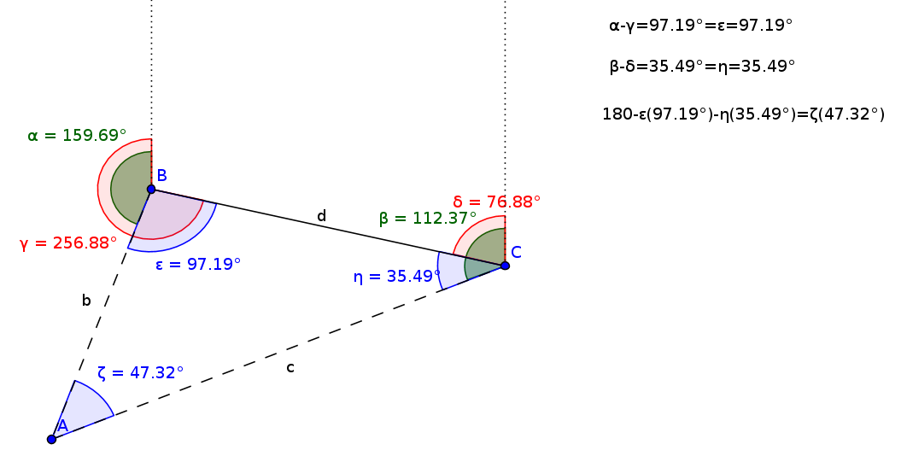
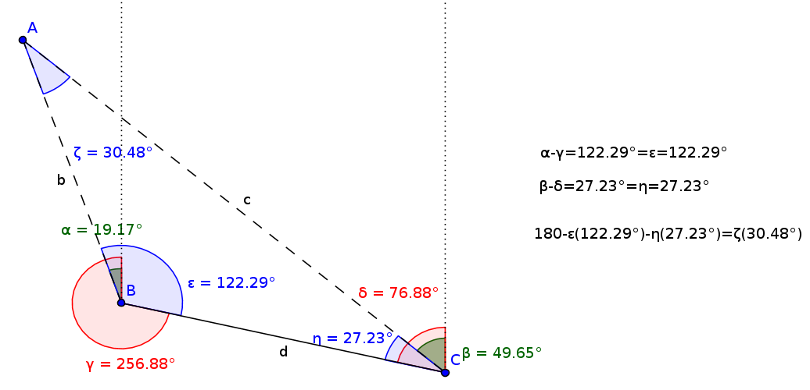
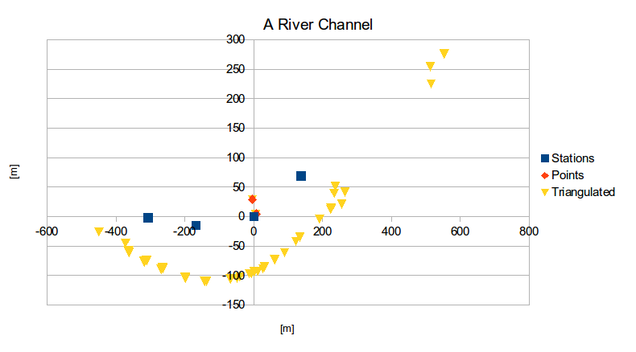

Sokkia SDR 33 Point Triangulation
=================================

This repository contains code for reading an SDR33 data logger file and using
angular observations recorded there in to triangulate the position of points
of interest.

Explanation
===========

The Sokkia SDR33 data logger is used in surveying to record data from, and to
control, certain total stations.

A total station works by firing a laser pulse at a distant object and recording
the length of time it takes for the pulse to return. This can be used to
calculate the distance to the object. Since the total station also records the
angles at which the pulse is fired, the distant object can be located in 3D
space. The angles and reflection time of the pulse can be measured to a high
degree of accuracy, allowing 3D position to be measured with accuracies of less
than a centimeter.

Some total stations can record the laser's reflection off of a variety of
surfaces, but, more commonly, the total station requires the use of a special
mirror or "prism" for the reflection to work.

Situations arise where a point to be surveyed cannot be accessed with the
prism. The location of such points cannot be directly determined.

However, the location of such a point can be triangulated by moving the total
station to two different locations and measuring the angles from each of these
locations to the unknown point. This is known as **triangulation**.

Since the SDR33 data logger does not have a triangulation option built in an
external program must be used to post-process the data. The program associated
with this README file performs this post-processing. The program reads an
unreduced SDR33 data file produced with Sokkia's ProLink software and returns
the triangulated position of one or more points.

Mathematics
===========
The total station has been set up in two locations, **B** and **C**, from which
it has taken angular measurements to a point of interest **A**.

All of the angular measurements are expressed in the range [0&deg;,360&deg;)
with 0&deg; being North.

Because **B** and **C** have known locations, the distance **d** between them
is also known. Likewise known are the red angles **&gamma;** (from **B**
to **C**) and **&delta;** (from **C** to **B**).

The green angles **&alpha;** (from **B** to **A**) and **&beta;** (from **C**
to **A**) denote the angle from a station to the object of interest.

By subtracting the green angles from the red angles, taking an absolute value,
and constraining the resulting angle to the range [0&deg;, 180&deg;), the blue
angles **&epsilon;** and **&eta;** result. These are two of the interior angles
of the triangle formed by the station locations and the point of interest.

The third angle of the triangle is easily found, since a triangle has 180&deg;.

The Law of Sines can then be used to deduce the vectors **b** and **c** from
both stations to the point of interest.

Examples of two possible setups are depicted below.

**Example One**

**Example Two**

Example
=======

The file [example.sdr](example.sdr) contains SDR33 survey data of a river
channel on the Olympic Peninsula. A second file,
[example-point-pairs](example-point-pairs) contains a list of paired angles
which are to be used to triangulate the position of the far side of the river
channel, which was otherwise uncrossable. When taking data in the field, each
pair of points should be noted so this file can later be created.

The blue squares depicte the four station locations used to 

